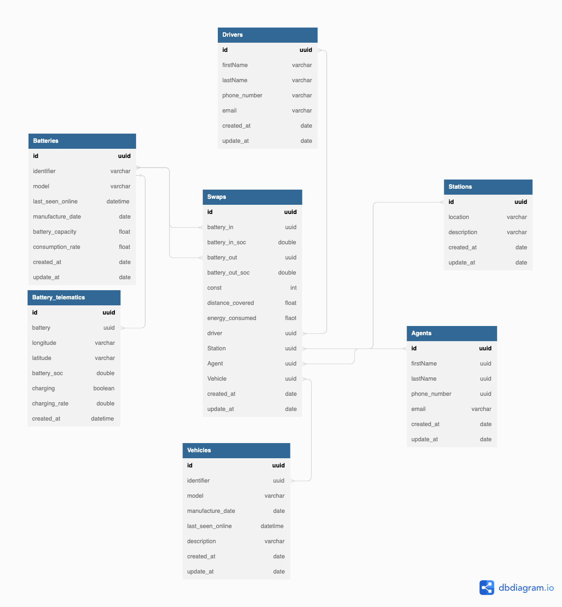
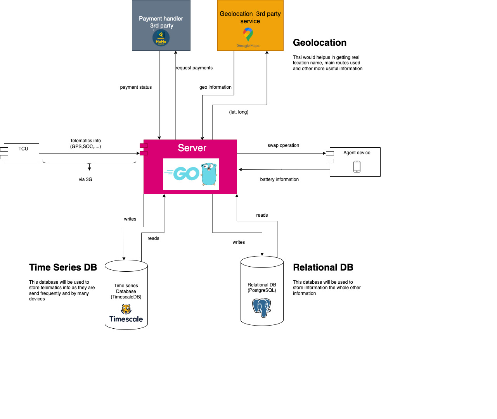

# Ampersand Project

This is an electric moto battery swap assistant system. helps monitoring live location, battery status and telematics of assets(electric battery and electric motorcycles). It also helps to manage the battery swap stations and the battery swap process.

## Getting Started

### Prerequisites

- Docker (app was tested on Docker version 20.10.23)
- Platform: any platform that can run docker will run this app

### Installing

- Clone the repo
- Run `docker compose up -d` in the root directory

### Using the app

- Open **Backend**, `http://localhost:8059/docs/index.html` in your browser, you will see the swagger documentation of the backend
- Open **Frontend**, `http://localhost:5059` in your browser, you will see the frontend of the app

> Note: ⚠️ Above url's should be working as expected only if you have the ports 8059 and 5059 free on your machine. If not, 
> 1. Ports might be in use by other apps. If so, try to find thos app and kill them. I don't advise changing ports in `.env` as it might make frontend break
> 2. Backend might not start property due to database connection issues. If so run `docker compose up -d app` you might be able to access the url


## Documentation

## User Stories
| User Story                                                   | Description                                                                                               |
|--------------------------------------------------------------|-----------------------------------------------------------------------------------------------------------|
| As a driver                                                 | I want to come to the swap station and have my depleted battery swapped with a charged battery          |
|                                                            | [so that I can continue my ride]                                                                          |
| As Ampersand                                                | I want to know which battery was used by which driver at which station,                                  |
|                                                            | [so that I can improve my statistics for strategic decision-making]                                       |
| As Ampersand                                                | I want to know which amount of energy was used by which battery                                          |
|                                                            | [so that I can know the amount of money to charge drivers on the swap]                                    |
| As Ampersand                                                | I need to see tracking of assets in motion                                                               |
|                                                            | [so that I can know which location drivers are mostly driving in]                                        |
| As Ampersand                                                | I need to know full information on battery swap                                                          |
| As Ampersand                                                | I need to see the telematics information                                                                 |


## ERD


## Architecture



  The architecture shows the different components of the system and how they interact with each other. The system is divided into 6 main components:

- **Frontend** - This is the user interface of the system. It is a web application built with Vue.js. It is responsible for displaying the data to the user and also for sending requests to the backend.
    **Why Vue.js?** it is a suitable framework for this project due to its simplicity and ease of use. It is also a lightweight framework, making it ideal for building web apps.
- **Backend** - This is the core of the system. It is a REST API built with Go. It is responsible for handling all the business logic of the system. It is also responsible for communicating with the database.
    **Why Go?** it is a suitable language for this project due to its efficiency in handling concurrent tasks, making it ideal for building services that manage real-time data, such as telematics from batteries and real-time updating of the state of charge (SoC).

- **Database** - This is where all the data is stored. It is a PostgreSQL and Unused Timescale database. It is responsible for storing all the data that is used by the system.
    **Why PostgreSQL?** sql mature db
    **Why Timescale?** (<span style="color:red">*This was not used due to time constraint*</span>) an extension to PostgreSQL that is optimized for storing and querying time-series data. It is ideal for storing telematics data from batteries. 

- **TCU** - (<span style="color:red">*This was not used due to time constraint*</span>) This is the telematics control unit.  It is responsible for collecting telematics data from the batteries and sending it to the backend.

- **Payment Gateway** - (<span style="color:red">*This was not used due to time constraint*</span>) This is a payment gateway that is responsible for handling payments from drivers. It is responsible for communicating with the backend. proposed **MOMO PAY**

- **Geolocation API** - (<span style="color:red">*This was not used due to time constraint*</span>) This is an API that is responsible for providing geolocation data. It is responsible for communicating with the backend. proposed **Google Maps API**


## App Demo

 As mentioned earlier, you should be able to access app on `http://localhost:5059` in your browser. If you go on app you might see a screen to create swap. basically it is adding swap information. 

 the app is preloaded with some data so that you don't have to put data to see the app working. but you may want to enter some your self. 

 so here are some data you ca use to create a swap. put them in the input fields and click on `Create Swap` button. you should see the swap you created in the list below.

 ```json
    // 1
    {
    "agent": 2,
    "battery_in": 1,
    "battery_out": 2,
    "driver": 1,
    "station": 2,
    "vehicle": 1
    }

    // 2
    {
    "agent": 1,
    "battery_in": 1,
    "battery_out": 2,
    "driver": 2,
    "station": 2,
    "vehicle": 1
    }

    // 3
    {
    "agent": 1,
    "battery_in": 1,
    "battery_out": 2,
    "driver": 2,
    "station": 1,
    "vehicle": 2
    }
```

